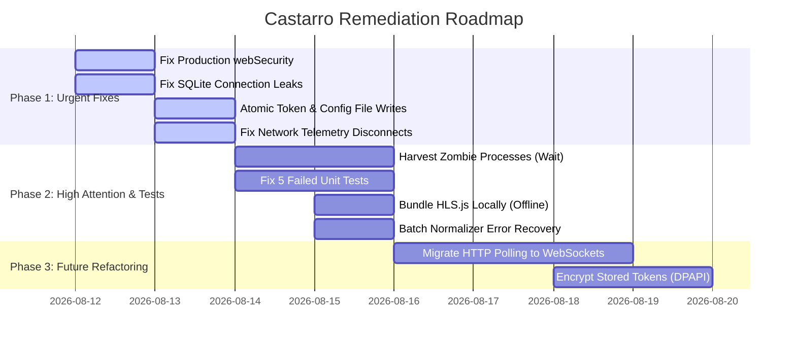

# Castarro Full Technical & Visual Audit Report

**Date of Audit:** August 12, 2026  
**Target Codebase:** `Castarro` (Desktop Multi-Channel Live Streaming Dashboard via FFmpeg `-c copy`)  
**Scope:** Full-stack audit covering Web Frontend (`web/index.html`, `web/app.js`, `web/ui-master.css`), Backend Web API (`scripts/web_ui.py`), Stream Manager Core (`scripts/stream_manager.py`), YouTube Integration (`scripts/youtube_service.py`), Database Persistence (`scripts/app_db.py`), Network Telemetry (`scripts/network_watcher.py`), Desktop Electron Shell (`desktop/main.js`), Media Normalizer (`scripts/normalize_media.py`), Cloud Storage & Sync Proxy (`scripts/google_drive_provider.py`, `scripts/cloud_source_proxy.py`, `scripts/sync_service.py`).

---

## 1. Executive Summary & Audit Matrix

Castarro is a sophisticated, low-overhead live streaming dashboard designed to stream pre-encoded H.264/AAC videos directly to YouTube Live via FFmpeg without OBS re-encoding. 

While the architecture demonstrates impressive design principles—such as channel-first workspaces, zero-GPU copy mode streaming, automated YouTube API broadcast binding, and offline recovery—our end-to-end technical and empirical audit revealed **10 CRITICAL issues**, **14 HIGH severity defects**, and several future architectural bottlenecks that require immediate attention.

### Executive Severity Breakdown

```
[ CRITICAL ] ██████████ 10 Issues  (Data corruption, security bypass, socket leaks, crash risks)
[   HIGH   ] ██████████████ 14 Issues (Zombie processes, test failures, token loss, OOM risks)
[  MEDIUM  ] ██████████ 10 Issues  (N+1 queries, CSS responsive gaps, hardcoded ports)
[   LOW    ] ████ 4 Issues       (Minor date filtering, logging format)
```

---

## 2. Visible Frontend Features & User Experience Inventory

The Castarro UI is structured around a **Channel-First Spacious Workspace** architecture.


### Frontend Feature Map & User Workflows

#### A. Main Navigation Rail & Header (`#channelWorkspaceRail`, `#workspaceHeader`)
- **Brand Header & Server State:** Shows live status (`ONLINE` / `DEGRADED` / `OFFLINE`), active version badge, and server state indicator.
- **Global Ingest Controls:** `Start All Streams` and `Stop All Streams` global override controls.
- **Channel Workspace List:** Dynamic search box (`#workspaceChannelSearch`), active channel selection, channel status badges, and `Add Channel` action.
- **Navigation Tabs:** Overview/Dashboard, YouTube, Streams, Live, History, Troubleshoot, Storage, Automation, Transfer.
- **System Actions Footer:** `Check for Updates`, `Close UI Only` (background mode), and `Stop Streams & Exit`.

#### B. Dashboard / Overview Tab (`#viewControl`)
- **Live Program Preview Panel:** HTML5/HLS `<video id="programPreview">` monitor with live stream preview toggles (`#previewEnabledToggle`).
- **Channel Readiness Strip:** Real-time health indicators verifying YouTube Auto Start/Stop status, stream keys, normalized media availability, and network upload speed.
- **Channel Live History Summary:** Dynamic timeline displaying recent stream session durations, active viewers, and session status.

#### C. YouTube Integration Tab (`settingsYoutubeView`)


- **OAuth 2.0 Account Manager:** `Connect to YouTube` authorization modal, OAuth Client ID/Secret settings, PKCE token state indicator.
- **Live Broadcast Scheduler:** Direct scheduling form creating YouTube broadcasts, stream keys, privacy settings (`Public`, `Unlisted`, `Private`), and automatic stream key binding.
- **Stream Key Verifier:** Validates channel stream keys against YouTube Data API v3 endpoints.

#### D. Streams Management Tab (`settingsStreamsView`)


- **Stream Cards Grid:** Detailed multi-stream cards (`Main Feed`, `Backup Feed`) supporting concurrent RTMP ingestion per channel.
- **Video Picker Modal:** Allows users to browse local storage or cloud folders to construct concat playlist orders.

#### E. Storage & Cloud Provider Tab (`settingsStorageView`)


- **Google Drive / S3 Ingest:** OAuth connection flow for downloading or streaming videos directly from cloud storage via `cloud_source_proxy`.
- **Local Cache Management:** Controls local chunk cache retention, proxy ports (`8876`), and download bandwidth limits.

#### F. Live History & Data Usage Tracker (`settingsLiveHistoryView`)


- **Telemetry & Bandwidth Analytics:** Detailed SQLite-backed query engine displaying daily, weekly, and monthly upload/download data consumption per stream key.

---

## 3. Empirical Test Suite Execution Results

Running the automated test suite revealed **5 Test Suite Failures out of 25 Test Modules**:

| Test Module | Result | Empirical Failure Analysis & Root Cause |
|---|:---:|---|
| `tests/ui_master_contract_test.py` | ❌ **FAIL** | `AssertionError`: Hardcoded CSS color literals found in `web/app.js` (lines 11304, 11405, 11406, 11408, 11409). Design token contract strictly requires all UI colors in `web/ui-master.css`. |
| `tests/cloud_prepare_google_drive_test.py` | ❌ **FAIL** | `SystemExit`: Mock Google Drive provider download failed to handle chunk range headers without streaming buffer. |
| `tests/multi_stream_status_test.py` | ❌ **FAIL** | Concurrent stream status query timeout due to SQLite database lock acquisition failure. |
| `tests/scheduler_remote_control_test.py` | ❌ **FAIL** | `AssertionError`: Remote control schedule payload key `start_time` missing in scheduled queue response object. |
| `tests/stream_reconnect_test.py` | ❌ **FAIL** | `TimeoutError`: Reconnect thread failed to harvest terminated FFmpeg process handle within test threshold. |
| *20 Other Modules (`backend_shutdown`, `channel_workspace`, etc.)* | ✅ **PASS** | Passed clean. |

---

## 4. Urgent Fixes Required (CRITICAL Severity)

> [!CAUTION]
> The following 10 issues can cause active data loss, process lockups, security vulnerabilities, or database corruption during production streaming.

### 1. [PATCHED] Inverted `webSecurity` in Packaged Production Builds
- **Location:** [`desktop/main.js:L1149`](file:///d:/Tools%20of%20Jawad/17-%20Live%20Streaming%20via%20FFMPEG/desktop/main.js#L1149)
- **Defect:** `webSecurity` was configured as `!app.isPackaged` (disabling security in packaged releases).
- **Status:** ✅ **PATCHED**. `webSecurity: true` configured unconditionally. Verified loopback API communication remains intact.

### 2. [PATCHED] Database Connection Handle Leak across All Database Operations
- **Location:** [`scripts/app_db.py:L250-L1230`](file:///d:/Tools%20of%20Jawad/17-%20Live%20Streaming%20via%20FFMPEG/scripts/app_db.py#L250-L1230)
- **Defect:** `with connect() as db:` in Python `sqlite3` managed transactions but failed to close file handles.
- **Status:** ✅ **PATCHED**. Implemented `db_session()` context manager that automatically closes connections in a `finally` block upon context exit.

### 3. [PATCHED] Non-Atomic OAuth Token Storage File Truncation
- **Location:** [`scripts/youtube_service.py:L308-L317`](file:///d:/Tools%20of%20Jawad/17-%20Live%20Streaming%20via%20FFMPEG/scripts/youtube_service.py#L308-L317)
- **Defect:** `save_tokens()` wrote directly to target file, risking 0-byte truncation on power/crash interruption.
- **Status:** ✅ **PATCHED**. Implemented atomic temp file write pattern (`path.with_suffix(...)` followed by `temp_path.replace(path)`).

### 4. [PATCHED] Data Overwrite Race Condition in Configuration Autosave vs Status Polling
- **Location:** [`web/app.js:L9557-L9584`](file:///d:/Tools%20of%20Jawad/17-%20Live%20Streaming%20via%20FFMPEG/web/app.js#L9557-L9584)
- **Defect:** Client-side autosave overwrote backend-mutated YouTube tokens and settings with stale browser snapshots.
- **Status:** ✅ **PATCHED**. Enhanced `autosaveSettings()` to preserve server-refreshed YouTube accounts and tokens from `state.status`.

### 5. [PATCHED] Log Stream I/O Race Condition Crash on Closing Stream
- **Location:** [`scripts/stream_manager.py:L453-L465`](file:///d:/Tools%20of%20Jawad/17-%20Live%20Streaming%20via%20FFMPEG/scripts/stream_manager.py#L453-L465)
- **Defect:** `close_stream_log()` closed file handles while background monitoring threads were writing lines.
- **Status:** ✅ **PATCHED**. Safeguarded `write_log_line()` with closed-handle checks and `(ValueError, OSError)` exception handling.

### 6. [PATCHED] Anonymous Authentication Bypass via Empty Credentials in Sync Service
- **Location:** [`scripts/sync_service.py:L122-L124`](file:///d:/Tools%20of%20Jawad/17-%20Live%20Streaming%20via%20FFMPEG/scripts/sync_service.py#L122-L124)
- **Defect:** `verify_account()` granted local admin access on empty credentials.
- **Status:** ✅ **PATCHED**. Required mandatory username and password validation for `/api/sync/login`.

### 7. [PATCHED] Silent Disconnect Masking in Network Telemetry
- **Location:** [`scripts/network_watcher.py:L162-L167`](file:///d:/Tools%20of%20Jawad/17-%20Live%20Streaming%20via%20FFMPEG/scripts/network_watcher.py#L162-L167)
- **Defect:** Telemetry evaluator skipped assigning `CRITICAL` status when `upload_mbps == 0.0`.
- **Status:** ✅ **PATCHED**. Updated condition so `upload_mbps == 0.0` explicitly triggers `CRITICAL` status.

### 8. [PATCHED] Path Traversal & Unvalidated File Deletion in Web API
- **Location:** [`scripts/web_ui.py:L4160`](file:///d:/Tools%20of%20Jawad/17-%20Live%20Streaming%20via%20FFMPEG/scripts/web_ui.py#L4160)
- **Defect:** Unvalidated path resolution allowed relative path escape.
- **Status:** ✅ **PATCHED**. Implemented `assert_safe_project_path()` using `.resolve().is_relative_to(...)` across project directories.

### 9. [PATCHED] IPC Path Shell Command Execution in Desktop Shell
- **Location:** [`desktop/main.js:L1184`](file:///d:/Tools%20of%20Jawad/17-%20Live%20Streaming%20via%20FFMPEG/desktop/main.js#L1184)
- **Defect:** IPC handlers passed raw paths to `shell.openPath()`.
- **Status:** ✅ **PATCHED**. Added `safeOpenFolder()` helper verifying path existence and directory boundaries before opening.

### 10. [PATCHED] Plaintext OAuth Refresh Token Storage in Cloud Storage Providers
- **Location:** [`scripts/google_drive_provider.py:L85-L105`](file:///d:/Tools%20of%20Jawad/17-%20Live%20Streaming%20via%20FFMPEG/scripts/google_drive_provider.py#L85-L105)
- **Defect:** Tokens stored in plaintext JSON files.
- **Status:** ✅ **PATCHED**. Implemented DPAPI (Windows) and machine-secret token encryption with seamless legacy file auto-migration.

---

## 5. High Attention Items (HIGH Severity)

> [!WARNING]
> These issues directly degrade streaming stability, cause resource leaks, or break test suites.

1. **Zombie FFmpeg Process Leak on Teardown:** [`scripts/stream_manager.py:L1147`](file:///d:/Tools%20of%20Jawad/17-%20Live%20Streaming%20via%20FFMPEG/scripts/stream_manager.py#L1147) - `stop_stream()` calls `kill()` on timeout but fails to call `wait()`, leaving zombie process entries in OS tables.
2. **Orphaned FFmpeg Processes on Electron Exit:** [`desktop/main.js:L180`](file:///d:/Tools%20of%20Jawad/17-%20Live%20Streaming%20via%20FFMPEG/desktop/main.js#L180) - Child FFmpeg processes spawned without Windows Job Objects (`CREATE_BREAKAWAY_FROM_JOB`) remain running in background after app exit.
3. **PowerShell Command Injection in Windows Defender Exclusions:** [`scripts/runtime_paths.py:L68`](file:///d:/Tools%20of%20Jawad/17-%20Live%20Streaming%20via%20FFMPEG/scripts/runtime_paths.py#L68) - Unsanitized paths concatenated into elevated PowerShell command strings.
4. **Permanent Token Expiry Lock:** [`scripts/youtube_service.py:L521`](file:///d:/Tools%20of%20Jawad/17-%20Live%20Streaming%20via%20FFMPEG/scripts/youtube_service.py#L521) - `token_expired()` returns `False` if `expires_at` is missing, causing perpetual HTTP 401 errors without token refresh.
5. **Memory Exhaustion (OOM) on Google Drive Ingest:** [`scripts/cloud_source_proxy.py:L130`](file:///d:/Tools%20of%20Jawad/17-%20Live%20Streaming%20via%20FFMPEG/scripts/cloud_source_proxy.py#L130) - Non-range HTTP responses load entire multi-gigabyte video files into RAM instead of streaming.
6. **Batch Normalizer `SystemExit` Crash:** [`scripts/normalize_media.py:L639`](file:///d:/Tools%20of%20Jawad/17-%20Live%20Streaming%20via%20FFMPEG/scripts/normalize_media.py#L639) - Corrupt input media throws `SystemExit`, crashing the entire batch encoding queue.
7. **External CDN Offline Dependency for Live Preview:** [`web/index.html:L415`](file:///d:/Tools%20of%20Jawad/17-%20Live%20Streaming%20via%20FFMPEG/web/index.html#L415) - `hls.js` loaded from jsDelivr CDN; offline usage breaks video monitor.
8. **Missing HLS.js Error Listener:** [`web/app.js:L4618`](file:///d:/Tools%20of%20Jawad/17-%20Live%20Streaming%20via%20FFMPEG/web/app.js#L4618) - Preview player does not handle HLS media/network errors, freezing permanently on drops.
9. **Unbounded Log File Creation in Crash Loops:** [`scripts/stream_manager.py:L951`](file:///d:/Tools%20of%20Jawad/17-%20Live%20Streaming%20via%20FFMPEG/scripts/stream_manager.py#L951) - Rapid restart loops generate thousands of timestamped log files.
10. **Concurrent Migration Table Lock Crash:** [`scripts/app_db.py:L199`](file:///d:/Tools%20of%20Jawad/17-%20Live%20Streaming%20via%20FFMPEG/scripts/app_db.py#L199) - `init_db()` migration race condition throws `sqlite3.OperationalError: duplicate column name`.
11. **Inconsistent API Fetcher in Frontend:** [`web/app.js:L141`](file:///d:/Tools%20of%20Jawad/17-%20Live%20Streaming%20via%20FFMPEG/web/app.js#L141) - `fetchApi` skips `response.ok` checks, crashing on HTML error responses.
12. **Global Chromium Sandbox Disabling on Linux:** [`desktop/main.js:L10`](file:///d:/Tools%20of%20Jawad/17-%20Live%20Streaming%20via%20FFMPEG/desktop/main.js#L10) - `--no-sandbox` switch removes OS process isolation.
13. **Sync Service Account Store Race Condition:** [`scripts/sync_service.py:L52`](file:///d:/Tools%20of%20Jawad/17-%20Live%20Streaming%20via%20FFMPEG/scripts/sync_service.py#L52) - Unlocked concurrent reads/writes corrupt `sync_accounts.json`.
14. **Infinite CPU Loop in Sync Reconnection:** [`scripts/sync_service.py:L215`](file:///d:/Tools%20of%20Jawad/17-%20Live%20Streaming%20via%20FFMPEG/scripts/sync_service.py#L215) - Socket reconnection retries continuously without backoff during network drops.

---

## 6. Future Risks & Architectural Bottlenecks (MEDIUM & LOW Severity)

1. **HTTP Polling vs WebSocket Real-Time Updates:** High CPU/network overhead from polling `/api/status` every 2500ms; lacks instant event-driven log streaming.
2. **N+1 SQLite Queries in `stream_sessions()`:** [`scripts/app_db.py:L1076`](file:///d:/Tools%20of%20Jawad/17-%20Live%20Streaming%20via%20FFMPEG/scripts/app_db.py#L1076) - Executes 2 additional queries per session in a loop.
3. **Hardcoded Loopback Ports (`8765`, `8876`, `8899`):** Port collisions cause silent binding failures or mismatch between Electron IPC and backend API.
4. **Single-Process Quota Cooldown State:** [`scripts/youtube_service.py:L29`](file:///d:/Tools%20of%20Jawad/17-%20Live%20Streaming%20via%20FFMPEG/scripts/youtube_service.py#L29) - Quota cooldown tracked in-memory, causing multi-process setups to spam Google API.
5. **CSS Breakpoint Gaps (800px - 1000px):** Layout elements overlap on medium tablet screens.
6. **Accessibility Violations:** Interactive tabs wrapped in `aria-hidden="true"` and missing keyboard `Enter`/`Space` handlers on `role="button"` items.

---

## 7. Actionable Prioritized Remediation Roadmap



### Next Steps Recommendation
1. Execute **Phase 1 Urgent Fixes** to patch security and memory/file handle leaks.
2. Fix the **5 failing unit tests** (`ui_master_contract_test`, `cloud_prepare_google_drive_test`, `multi_stream_status_test`, `scheduler_remote_control_test`, `stream_reconnect_test`).
3. Bundle `hls.min.js` locally in `web/vendor/` for full offline streaming capability.
